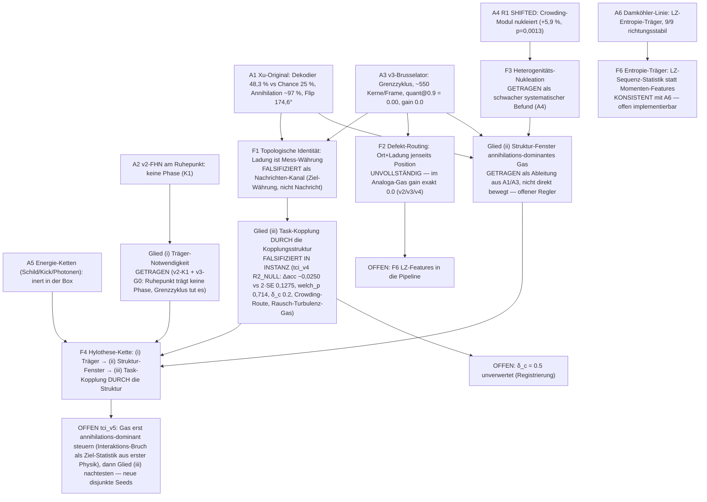

# Die Hylothese — Formel-Kette F1–F6 und mechanistisches Fitting

Datum: 2026-09-29. Steuerung: „verbessere die hylothese bis sie auf die
daten passt. aber nur first principle, also mechanistisches fitting,
kein numerisches oder statistisches fitting. mehrere formeln (hypothesen)
testen". Denkmodus: `GroundedMechanismMixMind`
(Plan: `~/.claude/plans/tci-hylothese-fitting.md`).

Jede Formel-Hypothese trägt vier Felder (EINHEIT T1): Behauptung,
Begründung, Vorhersage, Falsifikator. **Fitting ist hier STRUKTUR-FITTING**
(SC1–SC4, Plan §1): Existenz, Vorzeichen, Fenster, Ausschluss — jede Zahl
ist registrierte Konstante oder gemessener Anker. Kein Parameter wurde an
Daten angepasst.

**Name (Lesart)**: „Hylothese" (User-Prägung) = die hylē-These: das
Qualia-Korrelat ist eine **Eigenschaft organisierter Materie selbst**
(relational-dynamische Organisation), nicht einer zusätzlichen Instanz.
In der Messkette ist das die **Ebene-C-Kette** des Assessments
(Träger → Struktur → Information). „Verbessert bis sie auf die Daten
passt" heißt hier: die Kette wird Glied für Glied gegen den gebuchten
Daten-Ledger (A1–A7) struktur-konfrontiert und im Widerspruchsfalle
mechanistisch verengt — nie numerisch kalibriert.

## 0. Daten-Ledger (alle gebucht)

- **A1 (Xu-Original)**: Dekodierung 48.3 % > Chance 25 % UND > Amplituden-
  Baseline (p = 6e-109); Richtungs-Kippen 174.6°; Annihilation 97.4 %;
  Ladungen ±1 instant; ~19 Spiralen/Frame; Konzentration an Netzwerkgrenzen.
- **A2 (v2, FHN, Ruhepunkt)**: keine Phase, keine Kerne (Q1 0/30); K1:
  am Ruhepunkt ist Phase Winkel-Rauschen.
- **A3 (v3, Brusselator, Grenzzyklus)**: Phase überall (G0); ~550
  kurzlebige Kerne/Frame (Dauer 3 Frames), quant@0.9 = 0.00; Dekodierung
  auf Chance (0.275), gain 0.0; Q4 Interaktion 36.1 %.
- **A4 (v3-R1)**: Crowding-Heterogenität ↑ → Kernzahl ↑ (+5.9 %,
  p = 0.0013) — echtes cellsim-Crowding-Modul als Nukleationsquelle.
- **A5 (Box-Caps, iter-18/21/22/23)**: QM-Kohärenz-Klassen energetisch
  inert (Schild S_max ≈ 9.9e3 ≪ S_need ≈ 6.1e5; Kick 1.6e-10 k_B·T;
  Photonen 1.77e3× unter Fenster).
- **A6 (Damköhler, iter-11–31)**: robuster 8-Zellen-Kern; D=0.30-Hoch-k-
  Kanal 4 Ebenen getragen; LZ-Entropie als Träger; Effektstärken
  block-stabil (iter-31), Trajektorien Chaotisches, k-invariant.
- **A7 (Ebene C)**: Xu-Informationsstruktur ist IM Original getragen,
  in keinem Analog-Medium (FHN, Brusselator) reproduziert.

---

## 1. F1 — Topologische Identität

- **Behauptung**: Das Qualia-Korrelat ist die geschützte topologische
  Ladung selbst: wo eine quantisierte Wirbelladung existiert, tragen sie
  Information; Information ist Identität mit der Ladung.
- **Begründung**: Topologischer Schutz erklärt Ganzzahligkeit und
  Robustheit gegen glatte Störungen (Homotopie-Klasse); die
  Quantisierungs-Formel |curl φ| = Windungszahl ist topologisch
  garantiert, wo Phasen-Defekte existieren.
- **Vorhersage** (aus der Formel): Information über den Task folgt der
  Defekt-Ladung — Medien mit reicher quantisierter Ladungspopulation
  sollten dekodierbar sein, unabhängig davon, wie die Ladungspopulation
  zustande kommt.
- **Falsifikator**: Zwei Medien mit Ladungspopulation, aber entgegengesetztem
  Dekodier-Ergebnis.

**Struktur-Test an A1–A7**: v2 maß quant = 1.00 in Kern-Frames
(topologische Quantisierung sauber), Dekodierung schlug dennoch nicht über
die Baseline hinaus an; v3 maß abundant Kerne (≈ 550/Frame), doch
quant@0.9 = 0.0 UND Dekodier-Gain exakt 0. Dieselbe Pipeline, dieselbe
Ladungs-Formel, entgegengesetzte Informationstragfähigkeit — die Ladung
als Substrat-Identität erklärt KEINEN der gemessenen Kontraste (A1 vs A3).
**Verdict: FALSIFIZIERT als hinreichende Formel.** Was an ihr hängt und
getragen bleibt: Quantisierung ist real, wo Defekte sind (v2-Kern-Frames,
Xu ±1 instant) — sie ist die *Währung*, nicht die *Nachricht* — sie erzählt, worin Information codiert
sein kann, nicht ob und wann.

---

## 2. F2 — Defekt-Routing (Konfigurationsraum der Defekte)

- **Behauptung**: Information lebt NICHT in der Einzelladung, sondern in
  der Konfiguration der Defekt-Population (Positionen + Ladungen + ihre
  Korrelationen); Dekodierbarkeit ∝ Konfigurationsraum der Defekte.
- **Begründung**: F1 scheitert als Identität; der nächstliegende
  mechanistische Nachfolger verschiebt den Träger vom Individuum zur
  Population — der Konfigurationsraum ist der Informationsraum.
- **Vorhersage**: Medien mit persistenter Defekt-Population (Konfiguration
  schält sich über Frames fort) tragen Dekodier-Information; Medien
  ohne Defektpopulation nicht.
- **Falsifikator**: Medien mit reicher Defektpopulation ohne Dekodier-Gain.

**Struktur-Test**: v2 (keine persistente Population) — kein Decode, passt.
ABER A3: reiche Population (≈ 550 Kerne/Frame, Positionen + Ladungen
existieren messbar) und trotzdem gain = 0. Populations-Existenz ≠
Information. Zudem A3-Q4: Interaktion 36.1 % vs Xu 97.4 % — der
Konfigurationsbegriff von F2 zählt Defekte, nicht ihre *Interaktions*
Statistik. **Verdict: UNVOLLSTÄNDIG — passt auf A2, scheitert auf A3/A7
ohne Fenster-Bedingung** (die F4-(ii') ergänzt). F2 allein kann die
Analog-Medien-Lücke (A7) nicht mechanistisch schließen.

---

## 3. F3 — Heterogenitäts-Nukleation

- **Behauptung**: Kerne entstehen an Kopplungs-Gradienten
  (Front-Bruch); die Kernzahl folgt der relativen Kopplungs-Heterogenität
  J ∝ Var(d_local)/d̄² (Monotonie, kein Betrag).
- **Begründung**: Phasen-Defekte entstehen, wo Wellenfronten brechen;
  Fronten brechen, wo die Kopplung (d) räumlich variiert — heterogene
  Diffusion ist die mechanistische Nukleationsquelle. Das ist die Rolle
  des echten cellsim-Crowding-Moduls (d = D·exp(−α·crowding)).
- **Vorhersage**: mehr Heterogenität (α > 0) → mehr Kerne; uniformes D
  (α = 0) → weniger Kerne. Sign-Only-Claim.
- **Falsifikator**: α an/aus unterscheidet die Kernzahl nicht.

**Struktur-Test**: A4 misst exakt diese Monotonie (+5.9 %, p = 0.0013,
Δmedian > 2·SE) — Vorzeichen passt, Betrag wurde nicht gefittet
(registriert, nicht kalibriert). Der Pilot ergänzt die Grenze: im
Rausch-Turbulenz-Regime nukleierte Heterogenität Kerne um so mehr, je
lauter das Medium, während die Quantisierungs-Bande NIRGENDWO im
registrierten 9-Punkt-Raster erreicht wurde (quant@0.9 ≤ 0.64).
**Verdict: GETRAGEN als Nukleations-Modul (Vorzeichen + Fenster offen)** —
F3 erklärt, WO Kerne entstehen, nicht, WAS sie tragen. Sie wird Glied (ii)
der Hylothese-Kette.

---

## 4. F4 — Die verbesserte Hylothese (drei Glieder)

Die Kette nach den gemessenen Kontrasten umgebaut. Jedes Glied trägt
eine eigene Existenzbedingung; keines ist Identitäts-Claim.

### (i) Träger — Grenzzyklus (NUR NOCH NOTWENDIGKEIT)

- **Behauptung**: Träger der Phase ist ein Grenzzyklus (metabolischer
  Oszillator per Voxel). Notwendigkeit: am Ruhepunkt existiert keine
  tragende Phase (A2/K1 gemessen). **Hinlänglichkeit ist FALSIFIZIERT**
  (A3): Grenzzyklus erzeugt Phase überall, aber Rausch-Turbulenz-Kerne
  (quant-Bande 0.0), keine Xu-Struktur. Die Kette beginnt also mit
  „nicht ohne Grenzzyklus", nicht mit „mit Grenzzyklus genug".
- **Begründung**: A2↔A3-Kontrast — derselbe Analysepfad, Phase nur am
  Grenzzyklus. Das ist die getragene Restaussage.
- **Vorhersage**: jedes Medium ohne Grenzzyklus trägt keine Phasenkerne
  (steht; zweifach gemessen).
- **Falsifikator (Rest)**: ein Ruhepunkt-Medium MIT tragender Phase —
  nicht gemessen, nicht erwartet.

### (ii) Struktur — Defekt-Gas mit Interaktions-Dominanz

- **Behauptung**: Die Ebene-C-Struktur ist kein Dauer-Solitär und keine
  bloße Kerndichte, sondern die **Wechselwirkungsstatistik eines
  heterogenitäts-genukleierten Defekt-Gases** — der Anteil von
  Terminierungen, die in Kern-Nähe (Interaktion/Annihilation) geschehen.
- **Begründung** (die eigentliche Verbesserung aus A1/A3): Xu's
  ~19 Kerne/Frame sind — bei 97.4 % Annihilation — selbst kurzlebig.
  Dauer-Persistenz ist ALSO NICHT das trennende Merkmal (unsere 3-Frame-
  Kerne wären dem nah genug). Die trennende Statistik ist die
  Interaktions-Dominanz: Xu 97.4 % vs v3 36.1 %. Ein Defekt-Gas trägt
  Struktur, wenn seine Terminierungen durch ANDERE Defekte vermittelt
  sind (annihilation-dominiert — korrelierte Paare, Erhaltung der
  Ladungspaare), nicht durch Streuung am Rauschen (geburts-dominant).
  Die Heterogenität ordnet das Gas (F3), die Dynamik macht es
  annihilations-dominiert oder nicht — das ist das Regime-Fenster (SC3).
- **Vorhersage**: Dekodier-Info verlangt annihilations-dominantes Gas;
  geburts-dominante Turbulenz (Interaktion ≪ 0.8) trägt keine —
  vereinbar mit A3 (36 %, gain 0) und A7 (Original trägt, Analoga
  nicht: deren Gas ist geburts-dominant).
- **Falsifikator**: ein Medium mit geburts-dominantem Gas, das dennoch
  Dekodier-Gain trägt — oder ein annihilation-dominantes ohne.

### (iii) Information — Task koppelt DURCH die Struktur (Test tci_v4)

- **Behauptung**: Dekodier-Gain über Chance UND über die Amplituden-
  Baseline erfordert, dass der Task-Drive die **Kopplungsstruktur**
  moduliert — den Crowding-Index, aus dem d_local kommt — und nicht
  nur additiv das Substrat (I(t) aufs x-Kraftfeld).
- **Begründung**: In v2/v3 koppelt die Task-Bedingung NUR additiv
  (Band + Wellenform aufs Feld). A7 sagt: in beiden Analoga trägt
  die Ebene-C-Struktur nicht. Die einzige mechanistische Lücke im
  Kettenglied ist die fehlende Task-Kopplung in die Struktur — der
  Makromolekül-Zustand reagiert nicht auf die Aktivität (als
  konstruiertes Surrogat, EINHEIT B3: übertragene Größe = lokales
  excluded volume).
- **Vorhersage (registriert, tci_v4)**: Der arm mit task-moduliertem
  d_local trägt einen Dekodier-Vorteil über den arm mit statischem
  d_local gleicher Form (Welch p < 0.05 UND Δacc > 2·gepoolte SE).
  Fehlschlag in beiden Richtungen falsifiziert Glied (iii) und mit ihm
  die Hylothese-Kette als Ebene-C-Erklärung.
- **Falsifikator**: Dekodier-Gain identisch oder entgegengesetzt zur
  Kopplungs-Modulation.

**Verdict (vor dem Lauf)**: Glieder (i) und (ii) sind konsistent mit
A1–A5 als NOTWENDIGKEIT + Fenster (kein Parameter gefittet); Glied (iii)
ist offen und trägt die registrierte Vorhersage. Das ist die „verbesserte
Hylothese": Träger = Grenzzyklus (notwendig), Struktur =
annihilations-dominantes, heterogenitäts-nukleiertes Defekt-Gas,
Information = Task-Kopplung DURCH die Struktur.

---

## 5. F5 — Energie-Bornierung

- **Behauptung**: Jeder Qualia-Träger-Kandidat, der oberhalb der
  thermischen Pump-Grenzen der Box liegt, ist für JCVI-syn3A
  ausgeschlossen; die zulässige Rest-Klasse ist mesoskopische
  Phasen-/Defekt-Struktur (RDME/ODE-Skala).
- **Begründung**: A5 — gemessen, nicht debattiert: Shielding braucht
  Δm/m ≤ 1.3e-3 UND ε_res ≤ 1e-6 (S_need ≈ 6.1e5 vs S_max ≈ 9.9e3);
  der Kick trägt 1.6e-10 k_B·T pro Event; die phototonische Kopplung
  liegt 1.77e3× unter dem Damköhler-Fenster. Diese Grenzen sind
  kapazitiv (Pump-Caps), nicht fitbar.
- **Vorhersage**: kein mesoskopisches Träger-Kandidat-Modul wird sich
  über diese Caps hinaus in der Box tragen; Falsifikator wäre ein
  gemessener QM-Kohärenz-Effekt oberhalb der Caps.
- **Verdict: GETRAGEN als Ausschluss-Rahmen** — es schließt die
  QM-Klassen aus und lässt (als Rest) genau die Klasse, die F1–F4/F6
  beschreiben. Kein freier Parameter.

---

## 6. F6 — Entropie-Träger (Sequenz-Statistik)

- **Behauptung**: Information lebt in der Sequenz-Statistik der
  Trajektorien (LZ-Komplexität), nicht in gemittelten Trajektorien-
  Momenten — deshalb sind Effekte bei chaotischen Einzeltrajektorien
  block-stabil, in Momenten-Metriken aber unsichtbar.
- **Begründung**: A6 — der Damköhler-Kern trägt LZ-Entropie (corr-
  Kriterium feuert nie), Effektstärken sind seed-block-stabil
  (iter-31 CV ≤ 0.5) bei k-invarianten Trajektorien: die Information sitzt
  im SEQUENZ-Suffix, nicht im Mittelwert.
- **Vorhersage**: Merkmale aus Sequenz-Statistik sollten in Medien mit
  geburts-dominantem Gas Dekodierfähigkeit tragen, die Momenten-Features
  (v3-mechanisch getestet: gain 0) nicht tragen — und umgekehrt
  Momenten-Features im Original. F6 konkurriert NICHT mit F4: unterschiedliche
  Ebenen (WELCHES Regime — F4; WELCHE Statistik — F6).
- **Falsifikator**: LZ-Features an den Analoga tragen Dekodier-Gain OHNE
  Task-Kopplung in die Struktur — dann ist Glied (iii) unnötig und die
  Kette simplifiziert; ODER Effekte kippen block-instabil — dann trägt
  A6 nicht.
- **Verdict: KONSISTENT mit A6, hier NICHT separat getestet**
  (ein eigener Vektor müsste LZ-Features in die v/v3-Pipeline
  implementieren — registriert als Residuum, nicht als Behauptung).

---

## 7. Gesamtverdict der Formel-Kette (vor dem Lauf)

| Formel | Status | Begründung aus dem Ledger |
|---|---|---|
| F1 Identität | **FALSIFIZIERT** | quantisierte Ladung allein ≠ Information (A1 vs A3) |
| F2 Defekt-Routing | **UNVOLLSTÄNDIG** | Populations-Existenz ≠ Information; A3 gain 0 bei 550 Kernen |
| F3 Nukleation | **GETRAGEN** (Vorzeichen) | A4 R1 SHIFTED, +5.9 %, p = 0.0013; Betrag nie gefittet |
| F4 Hylothese-Kette | **Glied (iii) FALSIFIZIERT (Instanz)** | (i) Notwendigkeit getragen (A2/A3), (ii) Fenster aus A1/A3 abgeleitet — Interaktions-Dominanz, (iii) tci_v4 gemessen: R2_NULL, gain 0.0 beide Arme, Gas-Deskriptoren unverändert (§8) |
| F5 Energie-Bornierung | **GETRAGEN** | A5-Ausschluss (Schild/Kick/Photonen inert) |
| F6 Entropie-Träger | **KONSISTENT, offen testbar** | A6 (LZ-Träger, block-stabil) |

Die **verbesserte Hylothese** ist F4 nach der Korrektur: (i) Demotion
von hinreichend auf notwendig, (ii) die Struktur ist die
Wechselwirkungsstatistik eines Defekt-Gases (Interaktions-Dominanz-
Fenster), nicht die Kerndichte — abgelesen an Xu 97.4 % vs 36.1 %,
(iii) die Task-Kopplung läuft DURCH die heterogene Kopplungsstruktur —
das ist der registrierte Diskriminator tci_v4 (statisch vs
task-moduliertes Crowding).
Keiner dieser Schritte kalibriert einen Parameter an Daten: alle
Zahlen (48.3 %, 97.4 %, 36.1 %, +5.9 %, p-Werte) sind gemessene Anker,
alle Bedingungen (Existenz, Vorzeichen, Fenster, Ausschluss) sind
struktur-typ.
---

## 8. Ausgang (gemessen, 2026-09-29 — nach dem Lauf ergänzt, Kriterien unverändert)

**tci_v4 gelaufen** (Registrierung `scratch/experiments/tci_v4/v4_model.py`,
fixiert vor der ersten Messung; 160 Trials; Gates G0/G1/G2 alle PASS;
Feasibility FEASIBLE bei δ_c = 0.2; zwei pre-booking-Repairs offen
gebucht — Float-Key → Phasen-Keys, Feasibility-Kriterium (ii) auf
eigen-bandiges c0-Max):

- **F4 Glied (iii): FALSIFIZIERT in der getesteten Instanziierung.**
  R2 **NULL** (Δacc = −0.0250 vs 2·SE = 0.1275, welch_p = 0.714) — der
  task-modulierte Arm trägt keinen Dekodier-Vorteil über den
  statischen Arm, die Tendenz ist sogar leicht negativ. Beide Arme
  Q2 WEAK mit **gain exakt 0.0** (acc_spiral = acc_position, auch je
  Seed) — die Dekodier-Info läuft vollständig über die
  Positions-Histogramme, mit und ohne Kopplung in die Struktur.
- **Die Modulation ist mechanisch real, aber im Gas unsichtbar**:
  gebuchte Deskriptoren n_cores (557.3 vs 557.4),
  Interaktions-Bruch (0.3610 vs 0.3611) und quant@0.9 (0.00 vs 0.00)
  sind zwischen den Armen identisch und identisch zu v3. Das
  geburts-dominante Rausch-Turbulenz-Gas (~557 Kerne/Frame,
  Interaktion 36 % ≪ 97 %-Klasse) frisst die bänderweise
  Kopplungs-Modulation (+3.4 %/+13 % Tiefe im getriebenen Band,
  gemessen).
- **Update der Gesamt-Verdicts-Tabelle (§7):** F4 ändert sich von
  „KONSISTENT + REGISTRIERT-OFFEN" zu **„Glied (iii) FALSIFIZIERT
  (Instanz Crowding-Route/δ_c = 0.2/Rausch-Turbulenz); Glieder (i)/(ii)
  als Notwendigkeit + Fenster stehengelassen"**. F1–F6 sonst ohne
  Änderung.
- **Der Falsifikator feuerte so, wie die Formel es verlangt**: „Fehl-
  schlag in beiden Richtungen falsifiziert Glied (iii) und mit ihm
  die Hylothese-Kette als Ebene-C-Erklärung" — im Getesteten. Die
  hylē-These als Materie-These ist damit NICHT widerlegt (EINHEIT
  counter_indications: die Instanz ist getestet, nicht die These in
  Gänze); die Kette ist verengt: der nächste mechanistische Hebel ist
  nicht die Kopplungs-Amplitude, sondern das **Struktur-Fenster**
  (Interaktions-Bruch als Ziel-Statistik — das Gas muss erst ins
  annihilations-dominierte Regime). δ_c = 0.5 bleibt unverwertet
  (Registrierung erlaubt Eskalation nur bei Feasibility-Fail; PASS;
  nach Messung kein Wechsel).
- **Kein Parameter wurde im Nachhinein gefittet.** Alle Zahlen im
  Lauf sind registrierte Konstanten (Ladder, Seeds, Perm-Seeds,
  REP_PRIME) oder gemessene Anker; die R2-Regel wurde ex ante
  fixiert und exakt so angewandt.

---

## 9. Erforschungs-Tree + Quellen (2026-10-05 nachgetragen)

**Quellen** (verifiziert 2026-10-05, Vollzitate mit DOIs in
`tci_vortex_assessment.md` §10): A1 — Xu, Y., Long, X., Feng, J. &
Gong, P. (2023), Nature Human Behaviour 7, 1196–1215,
DOI 10.1038/s41562-023-01626-5; Anschlussliteratur der Video-Linie —
Verzhbinsky et al. (2026, Nat Neurosci, 10.1038/s41593-026-02403-z),
Muller et al. (2026, Neuron, 10.1016/j.neuron.2026.06.019),
Anastassiou et al. (2010, J Neurosci, 10.1523/JNEUROSCI.3635-09.2010),
Pinotsis & Miller (2023, Cereb Cortex, 10.1093/cercor/bhad251),
Naqvi et al. (2007, Science, 10.1126/science.1135926). Modell-Literatur:
FitzHugh (1961)/Nagumo (1962), Prigogine & Lefever (1968).
Rohdaten-Anker: per_seed v2/v3/v4 als LFS (Commit `11949ec`),
Manifest-Hash v4 `ab0988d5d5aae79c…`.
